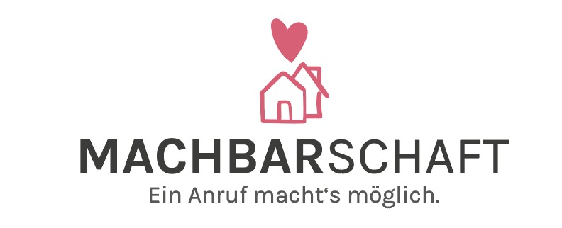

# Machbarschaft
## Android Application

Project Machbarschaft was created in the context of [WirVsVirus Hackathon](https://wirvsvirushackathon.org/) hosted by the German Government. Our pitch video can be found [on youtube](https://www.youtube.com/watch?v=8YJ0I0dMmWg). We also have a [Devpost Profile](https://devpost.com/software/einanrufhilft) and a website [machbarschaft.jetzt](https://machbarschaft.jetzt/).

This repository contains the Android Application which is meant for the helper, to find nearby help seeking persons. New Users have to verify their Identiy with Passbase(ID - Verfication) and SMS. Afterwards they can help others in need. 

## How it works

1. Install the MACHBARSCHAFT app to your Android device.
2. Click "Register" and fill the form with your personal data. Then verify your identity via Passbase.
3. You will get a SMS with a code from us. Type in this code on the shown page.
4. You are almost done! Your account was created successful. Now you can login with your phone number.
5. Search a job in your location. Then you call the person seeking help and make your way.
6. That's it! Deliver the order. Please make sure to follow the behaviour rules which can be found [here](https://github.com/machbarschaft/machbarschaft/blob/master/Verhaltensempfehlungen_für_MACHBAR_EINKAUF.pdf).

## Roadmap
### Phase 1: Prebuild and design ideas
#### Steps:
* Design and create wireframe.
* Select Android API version.

#### Tech:
* Figma (Wireframe)
* Trello (Ticket system)
* Java

### Phase 2: Build
#### Steps:
* Implement pages from wireframe
* Implement button interaction
* Implement registration and verification via passbase
* Implement placeholder orders and google maps API
* Implement Database interactions 
* Add designs to app

#### Tech:
* Java
* Trello 
* Github
* Google API
* Firebase API

#### Android Components:
* Foregroundservice with Notification 
* Activity
* Fused Location Provider for Location Tracking
* Static User Interface 
* Dynamic User Interface with Viewpager and Recycler View
* UI Resources: Drawables and Styles 
* Order User Interface: Dialogs 
* Storage: Shared Preferences 
* Build: Gradle
* 3rd Party Libaries: Rxjava
* Firebase: FCM, DB
* Architecture: MVVM 

### Phase 3: Future
#### Steps:
* Add database connection to fetch real orders
* Add homescreen footer button interactions
* Make design consistent 
* Add Junit Tests 
* Reduce APK size 
* Add Crashlytics 
* Publish in Play Store 
* Add further functionallic
* Implement new features from [here](https://github.com/machbarschaft/machbarschaft)

### Get in touch
Do not hesitate to get in touch with us. Drop us some nice words, suggestion, ideas or support by <a href="mailto:hallo@machbarschaft.jetzt?subject=hi">mail</a>. 

made with ❤ by us (machbarschaft).

